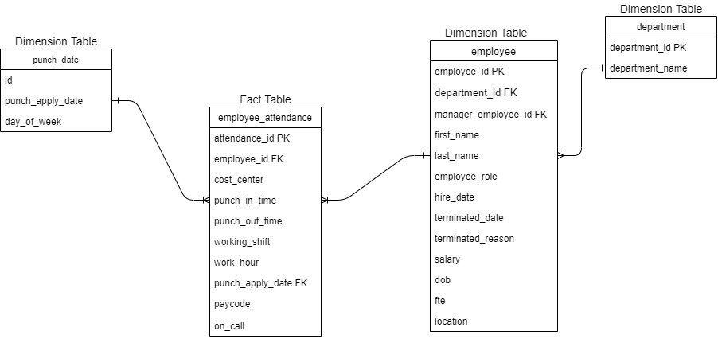

Data Warehouse 

Assignment #1

Prepared by Nischal Badal

**Identifying fact table and dimension table from given dataset and creating logical and physical model of the data warehouse** 

**Logical Data Modelling**

We Identify the entity and attributes to logically model the data. It is explained below:

|**Entity**|**Description**|**Domain**|
| - | - | - |
|department|
|department\_id|Identifier for department entity, PK|Number|
|department\_name|Name of the department|Text|
|employee|
|employee\_id|Identifier for employee entity, PK|Number|
|department\_id|Referencing to department entity, FK|Number|
|manager\_employee\_id|Referencing to employee table for manager employee, FK|Number|
|first\_name|First Name of Employee|Text|
|last\_name|Last Name of Employee|Text|
|employee\_role|Role of the employee|Text|
|hire\_date|Hire date of employee|Date|
|terminated\_date|Date of termination of employee|Date|
|terminated\_reason|Reason for Termination of employee|Text|
|salary|Salary of Employee|Big Float|
|dob|Date of Birth of employee|Date|
|fte|full time equivalence factor|Float|
|location|Address of employee|Text|
|employee\_attendance|
|attendance\_id|Identifier for attendance entity, PK|Auto Generated Number|
|employee\_id|Referencing to employee entity, FK|Number|
|cost\_center|Depart Name Listing|Number|
|punch\_in\_time|Time of punch in|DateTime|
|punch\_out\_time|Time of punch out|DateTime|
|working\_shift|Shift of working of employee, can be Morning or Evening shifts|Text|
|work\_hour|Total Hours worked|Float|
|punch\_apply\_date|Referencing to punch apply date entity, FK|Number|
|paycode|Code used in punchin as WRK, CHARGE, etc.|Text|
|on\_call|Boolean referring if employee is on call or not|Boolean|
|punch\_date|
|id|Identifier for punch\_date identity|Auto Generated Number|
|punch\_apply\_date|full date of punch records|Date|
|day\_of\_week|Name of day of week converted|Text|

In our given data set, there are data of employee and timesheet in weeks. To create the data warehouse, we need to classify them into fact table and dimensions table. The proposed data warehouse logical structure for the mentioned requirements could be:

`				`*Fig: Logical ER Model of Data Warehouse*

Now let us see how this ER model satisfies our requirements:

1. **Clients should be able to know if an employee was working on a particular day or not.** 
1. **If they worked,** 
1. **What time did they start and left?**
1. **How many hours?**
1. **Were they charge on the day?**
1. **If they didn’t,**
1. **Were they on call?**

**Answer:**
**
` `In our data warehouse, we have employee\_attendance as fact table where we can filter the punch\_in\_time, punch\_out\_time and  work\_hour. Also, there is a column called paycode which determines if they were charge or not.

Similarly, the CALL paycode on the employee\_attendance table determines of an employee was on call or not in a particular day.

1. ` `**Clients should be able to know if the employee had a Morning (Starting between 5: 00 AM - 11:00 AM) or Evening (Starting after 12:00 PM) shift.**

**Answer:** 

Similarly, there is a working\_shift column in the fact table which can be calculated as Morning (Starting between 5: 00 AM - 11:00 AM) or Evening (Starting after 12:00 PM) shift based on the maximum punch in time of any specific date.

This can help to identify if the employee had a morning or evening shift.

1. **Clients should be able to know if the employees are working regularly on a weekend (SUN, SAT)**

**Answer:** 

In our another dimension table called punch\_dates, we have converted punch\_apply\_date to char in postgresql which gives the day name and stored as day\_of\_week and filtering whether the employee has worked on SUN or SAT. If yes, we can sum the total number of worked days in weekend.

1. **Clients want to analyze if any employee has to cover for other team members regularly.**

**Answer:**

For this we can filter out the employees in same department by department id and we have the CHARGE column in paycode, which determines that if the employee was in CHARGE which means that he/she has to cover for other team members.

1. **Clients want to analyze the data on a biweekly basis starting from 2021-01-01**

**Answer:**

The records in the timesheet dimension table are stored as per day. It can be grouped as two weeks to obtained the data on a biweekly basis.

1. **Clients want to analyze the data based on the employee role.**

**Answer:**

There is a column called employee\_role in employee dimension table. This can be joined with employee\_id of the fact table and can be analyzed based upon the employee role. 

1. **Clients want to analyze the salary distribution by department.**

**Answer:**

The salary is dependent up on the department id and employee\_role. The salary and department\_id both are in the facts table and hence it can be analyzed.

**Physical Data Modelling**

After all the entity and attributes are identified, now the physical implementation is done using postgresql.
