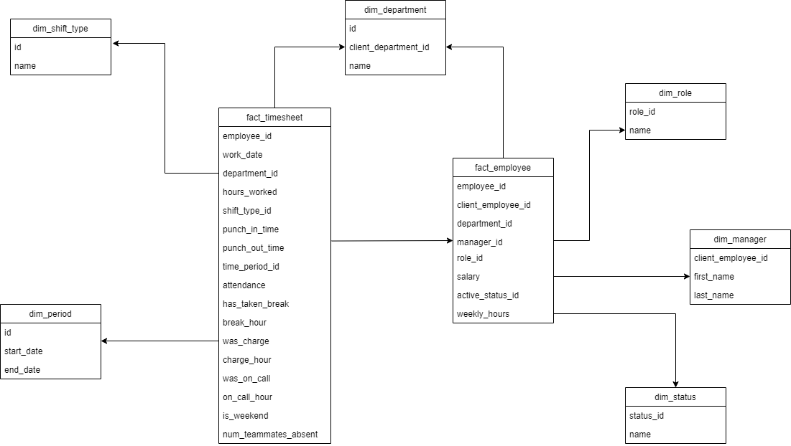

# ETL Design- Day 5
## Loading of Employee Data 

After successful extraction and transformation, we now load the Timesheet data into the Data Warehouse previously designed. 



The steps for loading the data into the respective facts and dimension tables are as follows:


## 1. Extracting employee table
Firstly, We add a function in _utils.py_ script which truncated the table and can be called elsewhere when needed.


```python
 def truncate_table(table_name, con, cur):
    with open("../sql/queries/truncate_table.sql") as f:
        sql = ' '.join(map(str, f.readlines()))% table_name
        print(sql)
        cur.execute(sql)       
        con.commit()
```
The _truncate_table.sql_ file contains are: 
```sql
TRUNCATE TABLE %s RESTART IDENTITY CASCADE;
```
The RESTART IDENTITY restarts the surrogate key which is mostly the primary key of the tables. This is done to avoid mismatch of id columns while loading the data.

## 2. Extracting and Archiving the raw_employee table

The structure of main _employee_ table was given as below:

```python
  def extract_employee_data(fileName, con, cur):
        with open(fileName, 'r') as f:
            i = 0
            for line in f:
                if i==0:
                    i+=1
                    continue
                row = line[:-1].split(",")
                with open("../sql/queries/extract_employee_data.sql") as f:
                    insert_query = ' '.join(map(str, f.readlines())) 
                    cur.execute(insert_query, row)     
                    con.commit()
        print("Extraction successful to raw_employee table.") 
```
This creates a _raw_employee_ table which contains all the raw data of the employee stored in the database.

```python
def archive_employee_data(con, cur):
        sql = '''SELECT employee_id,first_name,last_name,department_id,department_name,manager_employee_id,employee_role,salary,hire_date,terminated_date,terminated_reason,dob,fte,location
                FROM raw_employee;
                '''
        cur.execute(sql)
        result =cur.fetchall()
     
        insert_query = '''INSERT INTO copy_raw_employee(employee_id,first_name,last_name,department_id,department_name,
        manager_employee_id,employee_role,salary,hire_date,terminated_date,terminated_reason,dob,
                        fte,location)VALUES(%s,%s,%s,%s,%s,%s,%s,%s,%s,%s,%s,%s,%s,%s);'''
        for row in result:
            row= tuple(row)
            cur.execute(insert_query, row)
            con.commit() 
```
This function creates the archive copy or _raw_employee_ table which is used as backup for the further process of transformation and load of employee data.

## 3. Transforming  employee table
```python
  def transform_employee_data(con, cur):
        truncate_table("employee", con, cur)
        with open("../sql/queries/load_employee_table.sql") as f:
          sql = ' '.join(map(str, f.readlines()))
          print(sql)
          cur.execute(sql)       
          con.commit()
```
We initially truncate the table to clear all the datas and restart the surrogate keys so that the transformation process and loading process is successfully completed.
The SQL query in the file load_employee_table.sql is:
```sql
insert into employee(client_employee_id, department_id, first_name, last_name, manager_emp_id, salary,
                     hire_date, term_date, term_reason, dob, fte, weekly_hours, role)
select
    employee_id as client_employee_id,
    d.id as department_id,
    INITCAP(first_name) as first_name,
    INITCAP(last_name) as last_name,
    (case when manager_employee_id = '-' then null else manager_employee_id end) as manager_emp_id,
    cast(salary as float) as salary,
    cast(hire_date as date) as hire_date,
    cast(case when terminated_date='01-01-1700' then null else terminated_date end as date) as term_date,
    terminated_reason as term_reason,
    cast(dob as date) as dob,
    cast(fte as float) as fte,
    cast(fte as float) * 40 as weekly_hours,
    (case when employee_role LIKE '%Mgr%' AND employee_role LIKE '%Supv%' then 'Manager' else 'Supervisor' end) as role
from raw_employee
join department d on raw_employee.department_id = d.client_department_id
where employee_id <> 'employee_id';
```
This loads the transformed table named _employee_ with the data from the _raw_employee_ table.
## 4. Loading the dimensions table 

After all the dimension tables are created, we now load the tables and finally load the fact table referencing to the dimensions table using referential integrity constraints.

The methods for loading the dimension tables related with the _fact_employee_ table are as below:

```python
def load_dim_role(con, cur):
        truncate_table("dim_role", con, cur)
        with open("../sql/queries/extract_dim_role.sql") as f:
          sql = ' '.join(map(str, f.readlines()))
          print(sql)
          cur.execute(sql)       
          con.commit()
        print('Loading dim_role Success !')
```
Here, _dim_role_ table is loaded with the unique roles from the transformed employee table. The similar process is done with all other dimensions table linked to _fact_employee_ table.
```python
 def load_dim_manager(con, cur):
        truncate_table("dim_manager", con, cur)
        with open("../sql/queries/extract_dim_manager.sql") as f:
          sql = ' '.join(map(str, f.readlines()))
          print(sql)
          cur.execute(sql)       
          con.commit()
        print('Loading dim_manager Success !')
```

```python
def load_dim_department(con, cur):
        truncate_table("dim_department", con, cur)
        with open("../sql/queries/extract_dim_department.sql") as f:
          sql = ' '.join(map(str, f.readlines()))
          print(sql)
          cur.execute(sql)       
          con.commit()
        print('Loading dim_department Success !')
```
```python
 def load_dim_status(con, cur):
        truncate_table("dim_status", con, cur)
        with open("../sql/queries/extract_dim_status.sql") as f:
          sql = ' '.join(map(str, f.readlines()))
          print(sql)
          cur.execute(sql)       
          con.commit()
        print('Loading dim_status Success !')
```
## 4. Loading the Fact table

After all the dimension tables are loaded, now we finally load the fact table relating to the dimensions table.

The DDL syntax to create _fact_employee_ table is given below.

```sql
create table fact_employee(
    employee_id SERIAL PRIMARY KEY,
    client_employee_id VARCHAR(250),
    department_id INT,
    manager_id INT,
    role_id INT,
    salary FLOAT,
    active_status_id INT,
    weekly_hours FLOAT,
    CONSTRAINT fk_department_id FOREIGN KEY (department_id) REFERENCES dim_department(id),
    CONSTRAINT fk_manager_id FOREIGN KEY (manager_id) REFERENCES dim_manager(id),
    CONSTRAINT fk_role_id FOREIGN KEY (role_id) REFERENCES dim_role(id),
    CONSTRAINT fk_active_status_id FOREIGN KEY (active_status_id) REFERENCES dim_status(status_id)
);
```

Now we select all the attributes from the transformed table to load into the _fact_employee_ table:

```python
 def load_fact_employee(con,cur):
        truncate_table("fact_employee", con, cur)
        with open("../sql/queries/load_fact_employee.sql") as f:
          sql = ' '.join(map(str, f.readlines()))
          print(sql)
          cur.execute(sql)       
          con.commit()
        print('Loading fact_employee Success !')
```
The SQL query to load the _fact_employee_ table is shown below:

```sql
insert into fact_employee(client_employee_id, department_id, manager_id, role_id, salary, active_status_id, weekly_hours)
select
    e.client_employee_id,
    cast(department_id as INT) as department_id,
    dm.id as manager_id,
    dr.id as role_id,
    e.salary,
    (select status_id from dim_status where name=(case when e.term_date is not null then 'Terminated' else 'Active' end)) as active_status_id,
    e.weekly_hours
from employee e
    left join dim_manager dm on dm.client_employee_id = e.manager_emp_id
    join dim_role dr on e.role = dr.name;
```
After this query successfully executes, we have loaded the following table following ETL process:
_dim_role_, _dim_manager_, _dim_department_, _dim_status_ and _fact_employee_.

## 5. Implementing in python

The main() function of our python script file to perform all above mentioned functionalities is below:
```python
def main():
        con = connect()
        cur = con.cursor()

        truncate_table("raw_employee", con, cur)
        truncate_table("copy_raw_employee", con, cur)

        extract_employee_data("../../data/employee_2021_08_01.csv",con,cur)
        archive_employee_data(con,cur)

        truncate_table("fact_employee", con, cur)
        load_dim_role(con, cur)
        load_dim_manager(con, cur)
        load_dim_department(con, cur)
        load_dim_status(con, cur)
        load_fact_employee(con, cur)

        cur.close()
        con.close()

    if __name__ == '__main__':
        main()

```
In this way we extract, transform and load the HR Employee data into a _employee_ table. 