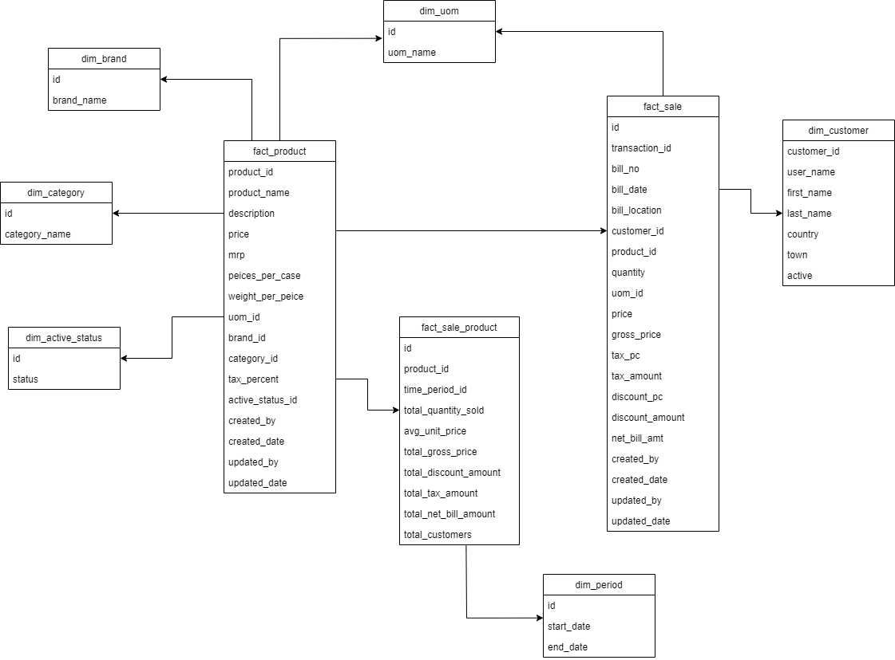

# ETL Process Documentation 
#### OLAP Weekend Assignment - Week 3
 After we have deisgned the conceptual and physical design of the warehouse, we now carry out the ETL (Extraction, Transformation and Loading) process to load the raw data into the data warehouse. 
 
 The proposed ER Diagram of the data warehouse:



 In the ETL process, the following steps were done:
 - Initially, we extract the given raw data into their respective raw tables. 
    They are: _raw_customer_, _raw_product_ and _raw_sales_.
- The  raw tables do not have any specific data types as all of them are stored as string to avoid mismatching of date formats from the incoming raw data. It is afterwards casted into their suitable data types using cast() method of postgresql.
- We also create archive tables for each raw table to maintain a historic datawarehouse that contails all the records before transformation and loading processes.
- After successful extraction, we now transform the data to load into our fact and dimension tables. 
- Some of the transformation applied to the raw data are:
    - Capitalizing first word of category names of products.
    - There was found an _ in the last name of the customer. It was removed by appllying regex_replace() method of postgresql.
    - Capitalizing the first word of country in customer table.
    - Conversion of active status of product into boolean data type.
    - Fixing the upper and lower case in _created_by_ and _updated_by_ columns in _product_ and _sale_ table.
    - There is an record for February 30 in the bill_date column which doesnot actually exist. Changing February 30 to February 28 in all tables.
    - Seperating the time period as an extra table named _dim_period_ so that the analysis can be done for certain time frame in _fact_sale_product_ table.
    - Summarization of records of _sale_ table applying different aggregation methods as sum(), avg(), count(), round() to keep precision levels in the _fact_sale_product_ table.
- After transformation, we now load the transformed data into respective dimension and fact tables. The order of loading is first to the dimension tables and then they are referenced to the fact tables as mentioned in the steps below.
- ###### Note: Each table except archive table is truncated initially to clear any previous values (if exists) and the ETL process could be completed without any referential constraint errors.

All of the above mentioned steps are furthur explained briefly below with their code and query snippets and screenshot of tables.

 # E - Extraction
We create three raw tables as per the data given named: _raw_customer_, _raw_product_ and _raw_sales_. The DDL queries of individual tables are given below in the respective manner.

```sql
CREATE TABLE raw_customer(
	customer_id VARCHAR(255),
	user_name VARCHAR(255),
	first_name VARCHAR(255),
	last_name VARCHAR(255),
	country VARCHAR(255),
	town VARCHAR(255),
	active VARCHAR(255)
);
```
```sql
CREATE TABLE raw_product(
	product_id VARCHAR(255),
	product_name VARCHAR(255),
	description VARCHAR(255),
	price VARCHAR(255),
	mrp VARCHAR(255),
	pieces_per_case VARCHAR(255),
	weight_per_piece VARCHAR(255),
	uom VARCHAR(255),
	brand VARCHAR(255),
	category VARCHAR(255),
	tax_percent VARCHAR(255),
	active VARCHAR(255),
	created_by VARCHAR(255),
	created_date VARCHAR(255),
	updated_by VARCHAR(255),
	updated_date VARCHAR(255)
);
```
```sql
CREATE TABLE raw_sales(
	id VARCHAR(255),
	transaction_id VARCHAR(255),
	bill_no VARCHAR(255),
	bill_date VARCHAR(255),
	bill_location VARCHAR(255),
	customer_id VARCHAR(255),
	product_id VARCHAR(255),
	qty VARCHAR(255),
	uom VARCHAR(255),
	price VARCHAR(255),
	gross_price VARCHAR(255),
	tax_pc VARCHAR(255),
	tax_amt VARCHAR(255),
	discount_pc VARCHAR(255),
	discount_amt VARCHAR(255),
	net_bill_amt VARCHAR(255),
	created_by VARCHAR(255),
	updated_by VARCHAR(255),
	created_date VARCHAR(255),
	updated_date VARCHAR(255)
);
```

Similarly, the archive tables are named as _copy_raw_customer_, _copy_raw_product_ and _copy_raw_sales_. 
Below is the DDL queries of archive tables.
```sql
CREATE TABLE copy_raw_customer(
	customer_id VARCHAR(255),
	user_name VARCHAR(255),
	first_name VARCHAR(255),
	last_name VARCHAR(255),
	country VARCHAR(255),
	town VARCHAR(255),
	active VARCHAR(255)
);
```
```sql
CREATE TABLE copy_raw_product(
	product_id VARCHAR(255),
	product_name VARCHAR(255),
	description VARCHAR(255),
	price VARCHAR(255),
	mrp VARCHAR(255),
	pieces_per_case VARCHAR(255),
	weight_per_piece VARCHAR(255),
	uom VARCHAR(255),
	brand VARCHAR(255),
	category VARCHAR(255),
	tax_percent VARCHAR(255),
	active VARCHAR(255),
	created_by VARCHAR(255),
	created_date VARCHAR(255),
	updated_by VARCHAR(255),
	updated_date VARCHAR(255)
);
```
```sql
CREATE TABLE copy_raw_sales(
	id VARCHAR(255),
	transaction_id VARCHAR(255),
	bill_no VARCHAR(255),
	bill_date VARCHAR(255),
	bill_location VARCHAR(255),
	customer_id VARCHAR(255),
	product_id VARCHAR(255),
	qty VARCHAR(255),
	uom VARCHAR(255),
	price VARCHAR(255),
	gross_price VARCHAR(255),
	tax_pc VARCHAR(255),
	tax_amt VARCHAR(255),
	discount_pc VARCHAR(255),
	discount_amt VARCHAR(255),
	net_bill_amt VARCHAR(255),
	created_by VARCHAR(255),
	updated_by VARCHAR(255),
	created_date VARCHAR(255),
	updated_date VARCHAR(255)
);
```
After creating the raw tables and their archive tables, we now perform insertion into the tables using python script. The database is connected using ```psycopg2``` driver for python3. The database connection script is:

```python
import psycopg2
def connect():
        return psycopg2.connect(
            user=os.getenv("user"),
            password=os.getenv("password"),
            host=os.getenv("host"),
            port=os.getenv("port"),
            database=os.getenv("database")
        )
```

The Extraction process of the _raw_customer_ table contains:

```python
def extract_customer_data(fileName, con, cur):
        with open(fileName, 'r') as f:
            i = 0
            for line in f:
                if i==0:
                    i+=1
                    continue
                row = line[:-1].split(",")
                with open("../sql/queries/extract_raw_customer_data.sql") as f:
                    insert_query = ' '.join(map(str, f.readlines())) 
                    cur.execute(insert_query, row)     
                    con.commit()
        print("Extraction successful to raw_customer table.") 
```
The raw data is loaded from the CSV file which is then read by python as file. The loop iterates through every line of the file and then creates an ```INSERT INTO table_name (columns) VALUES(values);``` query for all of them individually.

For a large dataset, this query might be time-taking as it creates an SQL syntax for all lines or rows in the files. If the data file and table is in same database server, we can use ```\COPY``` command of postgresql to import the CSV into the database.

Another reason for iterating through every records of file is that, we can remove the header columns  which is present in the CSV file. In our database, the first row was the header of columns and it was removed using a counter ```i``` through our python script. 
 
 Similarly, the archiving is done by the script below:
 ```python
 def archive_customer_data(con, cur):
        with open("../sql/queries/extract_copy_raw_customer_data.sql") as f:
            sql = ' '.join(map(str, f.readlines())) 
            cur.execute(sql)
            con.commit()
        print("Archiving successful to copy_raw_customer table.") 
 ```
 The methods previously defined are called in the main function of python.
 
 ```python
   def main():
        con = connect()
        cur = con.cursor()

        truncate_table("raw_customer", con, cur)
        
        extract_customer_data("../../data/customer_dump.csv",con,cur)
        archive_customer_data(con, cur)
      
        cur.close()
        con.close()

    if __name__ == '__main__':
        main()
 ```
 Here, we truncate the table before applying extraction so that no previous records are present in the raw table and the ETL process is completed smoothly.
 
 The similar process is used in extracting raw tables and archiving them for all of the other raw tables. Their code snippets are attached hereafter.
 
 For _raw_product_ table:
 ```python
   def extract_product_data(fileName, con, cur):
        with open(fileName, 'r') as f:
            i = 0
            for line in f:
                if i==0:
                    i+=1
                    continue
                row = line[:-1].split(",")
                with open("../sql/queries/extract_raw_product_data.sql") as f:
                    insert_query = ' '.join(map(str, f.readlines())) 
                    cur.execute(insert_query, row)     
                    con.commit()

        print("Extraction successful to raw_product table.") 
    
       
    def archive_product_data(con, cur):
        with open("../sql/queries/extract_copy_raw_product_data.sql") as f:
            sql = ' '.join(map(str, f.readlines())) 
            cur.execute(sql)
            con.commit()

        print("Archiving successful to copy_raw_product table.") 
 ```
 For _raw_sales_ table:
 ```python
 def extract_sales_data(fileName, con, cur):
        with open(fileName, 'r') as f:
            i = 0
            for line in f:
                if i==0:
                    i+=1
                    continue
                row = line[:-1].split(",")
                with open("../sql/queries/extract_raw_sales_data.sql") as f:
                    insert_query = ' '.join(map(str, f.readlines())) 
                    cur.execute(insert_query, row)     
                    con.commit()
        print("Extraction successful to raw_sales table.") 
    
       
    def archive_sales_data(con, cur):
        with open("../sql/queries/extract_copy_raw_sales.sql") as f:
            sql = ' '.join(map(str, f.readlines())) 
            cur.execute(sql)
            con.commit()
        print("Archiving successful to copy_raw_sales table.") 
 ```
 All the SQL queries used in the extraction process are stored in a separate file and called from file reading lines that makes our extraction code clean and easier to debug.
 
 The SQL queries used in above extraction and throughout other process of transformation and loading are [here](https://github.com/nischalbadal/data-warehouse-assignments-leapfrog/tree/weekend-assignment/weekend-assignment/src/sql/queries).
 
## T - Transformation and L- Loading

After the extraction and archiving process is completed successfully, we have three raw tables and archive tables that stores raw data and hostoric raw datas respectively. 

In the transformation process, we can create separate tables or temporary tables to store values that is finally loaded into the final table of the warehouse i.e. facts and dimensions.

Since in our data, we do not need to create those intermediate tables, we directly apply transformation and load to the final tables of the warehouse. 

In one scenario, we have to create a view to categorize the time periods as we explicitly insert few records in the _dim_period_ table. This _dim_period_ table helps to analyze the sales data within a certain time period. The view created maps to a respective record for the _bill_date_ of the _fact_sales_ table to the _id_ of the _dim_period_ table.

Each process of transforming and loading to the final tables are briefly described below:

#### ```dim_customer``` table
In _dim_customer_ table, we load it directly as it is a dimension table. The SQL query to apply transformation and load _dim_customer_ table is:

```sql
INSERT INTO dim_customer (customer_id, user_name, first_name, last_name, country, town, active)
SELECT
cast(customer_id AS INT) as customer_id,
user_name AS user_name,
first_name AS first_name,
regexp_replace(last_name, '[^\w]+_','') AS last_name,
INITCAP(country) as country,
town,
CASE WHEN active = 'Y' THEN true ELSE false end as active
FROM raw_customer c;
```
Here, we apply a transformation to replace any extra characters as whitespace, underscore from the _last_name_ column of the customer as in one record, we see the '_' appended in the last name of the customer.
We also capitalize first letter of _country_ column. And finally, we change the 'Y' and 'N' characters of the _active_ column as BOOLEAN data type into our final _fact_customer_ table.

#### ```fact_product``` table and its corresponding dimension tables
While transforming and loading the _fact_product_ table, we initially load the dimension tables linked with the fact table and reference them into the fact table using referential integrity keys(i.e. Primary Key and Foreign Key).

We first load the _dim_brand_ table which is the table containing brand names of the products.
To extract the _dim_brand_, we select the distinct _brand_ column from the _raw_product_ table and insert it into the _dim_brand_ table.
```sql
INSERT INTO dim_brand(brand_name)
SELECT DISTINCT(brand) FROM raw_product;
```
Similar to the _dim_brand_, _dim_category_ and _dim_active_status_ are loaded into their respective tables.
```sql
INSERT INTO dim_category(category_name)
SELECT DISTINCT(INITCAP(category)) FROM raw_product;
```
As we can see, we have transformed the _category_ column from the _raw_product_ table to capitalise the first characters.

```sql
INSERT INTO dim_active_status(status)
select distinct active from raw_product;
```
After transforming and loading all the dimension tables, we now transform and load the _fact_product_ table.
The SQL query is:
```sql
INSERT INTO fact_product(product_id, product_name, description, price, mrp, pieces_per_case, weight_per_peice, uom_id, brand_id,
                         category_id, tax_percent, active_status_id, created_by, created_date, updated_by, updated_date)
SELECT
CAST(product_id AS INT) AS product_id,
product_name AS product_name,
description AS description,
CAST(price AS FLOAT) AS price,
CAST(mrp AS FLOAT) AS mrp,
CAST(pieces_per_case AS INT) AS pieces_per_case,
CAST(weight_per_piece AS FLOAT) AS weight_per_piece,
u.id as uom_id,
b.id AS brand_id,
c.id AS category_id,
CAST(tax_percent AS FLOAT) AS tax_percent,
a.id AS active_status_id,
INITCAP(created_by) AS created_by,
CASE
    WHEN created_date = '2017-02-30 11:00:00'
        THEN TO_TIMESTAMP('2017-02-28 11:00:00', 'YYYY-MM-DD HH24:MI:SS')
    ELSE TO_TIMESTAMP(created_date, 'YYYY-MM-DD HH24:MI:SS')
    END AS created_date,
 INITCAP(updated_by) AS updated_by,
CASE
    WHEN updated_date = '2017-02-30 11:00:00'
        THEN TO_TIMESTAMP('2017-02-28 11:00:00', 'YYYY-MM-DD HH24:MI:SS')
    WHEN updated_date = '-' THEN NULL
    ELSE TO_TIMESTAMP(updated_date, 'YYYY-MM-DD HH24:MI:SS')
    END AS updated_date
FROM raw_product p
INNER JOIN dim_uom u on p.uom = u.uom_name
INNER JOIN dim_brand b on p.brand = b.brand_name
INNER JOIN dim_category c on INITCAP(p.category) = c.category_name
INNER JOIN dim_active_status a on p.active = a.status;
```

Here, we do not create any intermediate tables. We directly select from the raw table, transform them and insert into the fact table. 

One major transformation that can be seen here is the conversion of '2017-02-30 11:00:00' timestamp into '2017-02-28 11:00:00' because no such date exist in real world as February 30. This cause error while loading in the fact table. Hence, we had to transform it to acceptable value and format.

Initially, we had stored all the records of raw table as string and hence we have to cast them into their respective formats using ```CAST()``` function.

The python script for applying the transformation and loading in order is:
```python
def load_dim_brand(con, cur):
        truncate_table("dim_brand", con, cur)
        with open("../sql/queries/extract_dim_brand_data.sql") as f:
            sql = ' '.join(map(str, f.readlines())) 
            cur.execute(sql)
            con.commit()

        print("Loading of dim_brand table successful.") 
    
    def load_dim_category(con, cur):
        truncate_table("dim_category", con, cur)
        with open("../sql/queries/extract_dim_category_data.sql") as f:
            sql = ' '.join(map(str, f.readlines())) 
            cur.execute(sql)
            con.commit()

        print("Loading of dim_category table successful.") 
    
    def load_dim_active_status(con, cur):
        truncate_table("dim_active_status", con, cur)
        with open("../sql/queries/extract_dim_active_status_data.sql") as f:
            sql = ' '.join(map(str, f.readlines())) 
            cur.execute(sql)
            con.commit()

        print("Loading of dim_active_status table successful.") 


    def load_fact_product(con, cur):
        with open("../sql/queries/extract_fact_product_data.sql") as f:
            sql = ' '.join(map(str, f.readlines())) 
            cur.execute(sql)
            con.commit()

        print("Loading of fact_product table successful.") 
```

While the main method in python to call the functions are:

```python
    def main():
        con = connect()
        cur = con.cursor()

        truncate_table("raw_product", con, cur)

        extract_product_data("../../data/product_dump.csv",con,cur)
        archive_product_data(con, cur)

        truncate_table("fact_product", con, cur)
        load_dim_brand(con, cur)
        load_dim_category(con, cur)
        load_dim_active_status(con, cur)
        load_fact_product(con, cur)

        cur.close()
        con.close()

    if __name__ == '__main__':
        main()
```
We initially truncate the _fact_product_ table and then load into the dimension and fact tables.

#### ```fact_sales``` table and its corresponding dimension tables
As we can see in our conceptual design of data warehouse, _fact_sales_ table has only one dimension table: _dim_uom_. We load the dimension table first and then load the fact table.

For _dim_uom_ table:
```sql
INSERT INTO dim_uom(uom_name)
select distinct uom from raw_product;
```
And the python script to load _dim_uom_ table is:
```python
 def load_dim_uom(con, cur):
        truncate_table("dim_uom", con, cur)
        with open("../sql/queries/extract_uom_data.sql") as f:
            sql = ' '.join(map(str, f.readlines())) 
            cur.execute(sql)
            con.commit()

        print("Loading of dim_uom table successful.") 
```

Now, we load the _fact_sales_ table:
```sql
INSERT INTO fact_sale(id, transaction_id, bill_no, bill_date, bill_loaction, customer_id, product_id, quantity, uom_id, price,
                      gross_price, tax_pc, tax_amount, discount_pc, discount_amount,  created_by, created_date,updated_by,updated_date)
SELECT
       CAST(s.id AS INT) AS id,
       CAST(transaction_id AS INT) as transaction_id,
       CAST(bill_no AS INT) as bill_no,
       CASE
           WHEN bill_date = '2017-02-30 11:00:00' THEN TO_TIMESTAMP('2017-02-28 11:00:00', 'YYYY-MM-DD HH24:MI:SS')
           ELSE TO_TIMESTAMP(bill_date, 'YYYY-MM-DD HH24:MI:SS')
           END AS bill_date,
       bill_location,
       CAST(customer_id AS INT) AS customer_id,
       CAST(product_id AS INT) AS product_id,
       CAST(qty AS INT) AS quantity,
       u.id AS uom_id,
       CAST(price AS FLOAT) AS price,
       CAST(gross_price AS FLOAT) AS gross_price,
       CAST(tax_pc AS FLOAT) AS tax_pc,
       CAST(tax_amt AS FLOAT) AS tax_amountt,
       CAST(discount_pc AS FLOAT) AS discount_pc,
       CAST(discount_amt AS FLOAT) AS discount_amt,
       INITCAP(created_by) AS created_by,
       CASE
           WHEN created_date = '2017-02-30 11:00:00'
               THEN TO_TIMESTAMP('2017-02-28 11:00:00', 'YYYY-MM-DD HH24:MI:SS')
           ELSE TO_TIMESTAMP(created_date, 'YYYY-MM-DD HH24:MI:SS')
           END AS created_date,
        INITCAP(updated_by) AS updated_by,
       CASE
           WHEN updated_date = '2017-02-30 11:00:00'
               THEN TO_TIMESTAMP('2017-02-28 11:00:00', 'YYYY-MM-DD HH24:MI:SS')
           WHEN updated_date = '-' THEN NULL
           ELSE TO_TIMESTAMP(updated_date, 'YYYY-MM-DD HH24:MI:SS')
           END AS updated_date
FROM raw_sales s
INNER JOIN dim_uom u
ON s.uom = u.uom_name
WHERE CAST(s.qty AS INT) <> 0;
```

Here also, we have applied the transformation to change date of February 30 and we have transformed the cases of _created_by_ and _updated_by_ columns as well.

Similarly, some records were seen having quantity 0 in sales record. They were omitted while inserting into the final _fact_sales_ table as they posses no value.

The python script: 
```python
 def load_fact_sales(con, cur):
        with open("../sql/queries/extract_fact_sales_data.sql") as f:
            sql = ' '.join(map(str, f.readlines())) 
            cur.execute(sql)
            con.commit()
        print("Transformation and Loading successful to fact_sales table.") 
```

The main function in python where all the functions are called:
```python
 def main():
        con = connect()
        cur = con.cursor()

        truncate_table("raw_sales", con, cur)
        truncate_table("copy_raw_sales", con, cur)

        extract_sales_data("../../data/sales_dump.csv",con,cur)
        archive_sales_data(con, cur)

        load_fact_sales(con, cur)

        cur.close()
        con.close()

    if __name__ == '__main__':
        main()
```

#### ```fact_sale_product``` table along with its dimension table

All the tables above this step were given in the dataset. This is a summarization table that is created to analyze the sales data. This table aggregates the parameters as _quantity_, _price_, _gross_price_, _discount_amount_, _tax_amount_, _net_bill_amt_ and also calculates _total_customers_ count for any specific _product_id_ from the _raw_sales_ table.

There is one dimension table associated with this fact table which is populated manually so that the analysis can be done within a specific time frame.

Loading of _dim_period_ table:
```sql
INSERT INTO dim_period(start_date, end_date)
VALUES('2017-01-01','2017-04-01'),('2017-04-01','2017-08-01'),('2017-08-01','2017-12-30');
```
Here, 3 values are inserted with a difference of 4 months under the maximum and minimum of _bill_date_ column of the sales table.

Additionally, we create a view to list the _bill_date_ from the _fact_sale_ table and map them to their respective _id_ from the _dim_period_ table and use it afterwards to load the _fact_sale_product_ table.

The SQL query to create and load view is:
```sql
CREATE VIEW get_dim_period_id_view AS(
    SELECT DISTINCT
          CASE WHEN s.bill_date = '2017-02-30 11:00:00'
          THEN TO_DATE('2017-02-28', 'YYYY-MM-DD') ELSE TO_DATE(s.bill_date, 'YYYY-MM-DD') END as bill_date,
           (SELECT id from dim_period p
            WHERE p.start_date <= (CASE WHEN s.bill_date = '2017-02-30 11:00:00'
                THEN TO_DATE('2017-02-28', 'YYYY-MM-DD') ELSE TO_DATE(s.bill_date, 'YYYY-MM-DD') END)
               AND p.end_date > (CASE WHEN s.bill_date = '2017-02-30 11:00:00'
                THEN TO_DATE('2017-02-28', 'YYYY-MM-DD') ELSE TO_DATE(s.bill_date, 'YYYY-MM-DD') END)
               )
               as time_period_id
    from raw_sales s
);
```

Now executing the above query from python script:
```python
 def load_related_views(con, cur):
        with open("../sql/queries/extract_get_dim_period_id_view.sql") as f:
            sql = ' '.join(map(str, f.readlines())) 
            cur.execute(sql)
            con.commit()
        print("Loading dim_period_id_view view successful.") 
```

Finally, we load the _fact_sale_product_ table. The transformation and loading SQL query is:
```sql
INSERT INTO fact_sale_product(product_id, time_period_id, total_quantity_sold, avg_unit_price, total_gross_price, total_discount_amount,
                              total_tax_amount, total_net_bill_amount, total_customers)
SELECT
    product_id,
    (SELECT time_period_id FROM get_dim_period_id_view v
    WHERE v.bill_date = s.bill_date
        ) as time_period_id,
    SUM(CAST(quantity AS INT)) AS total_quantity_sold,
	ROUND(AVG(CAST(price AS FLOAT))::NUMERIC,2) AS avg_unit_price,
	ROUND(SUM(CAST(gross_price AS FLOAT))::NUMERIC,2) AS total_gross_price,
	SUM(CAST(discount_amount AS FLOAT)) AS total_discount_amount,
	ROUND(SUM(CAST(tax_amount AS FLOAT))::NUMERIC,2) AS total_tax_amount,
	ROUND(SUM(CAST(net_bill_amt AS FLOAT))::NUMERIC,2) AS total_net_bill_amount,
    COUNT(customer_id) AS total_customers
FROM fact_sale s
GROUP BY product_id, s.bill_date;
```
Here, as mentioned earlier, we can see many transformations applied having aggregation methods as ```SUM()```,```AVG()```,```ROUND()``` and ```COUNT()```.

After this transformation query, we create a function in python to perform this operation as:
```python
def load_fact_sale_product(con, cur):
        with open("../sql/queries/extract_fact_sale_product_data.sql") as f:
            sql = ' '.join(map(str, f.readlines())) 
            cur.execute(sql)
            con.commit()
        print("Transformation and Loading successful to fact_sale_product table.")
```

Finally, the main function of python script looks like:
```python
 def main():
        con = connect()
        cur = con.cursor()

        truncate_table("fact_sale_product", con, cur)
        
        load_dim_period(con, cur)
        load_fact_sale_product(con, cur)

        cur.close()
        con.close()

    if __name__ == '__main__':
        main()
```

####  In this way, we have successfully completed the Extraction, Transformation and Loading od raw eCommerce data into designed warehouse.

Some of the things to mention:
- All the python scripts were written with proper error handling using ```try-except``` block.
```python
from utils import *

try:
    #extraction methods here
    def main():
        con = connect()
        cur = con.cursor()

      #calling functions here

        cur.close()
        con.close()

    if __name__ == '__main__':
        main()

except Exception as e:
     print('Error: ' + str(e))
```
- The frequent queries were separated from the files to avoid repeating of code. ```connect()``` and ```truncate_table()``` are separated and placed as a different script named ```utils.py``` and imported whenever needed.
```python
import psycopg2
from dotenv import load_dotenv
load_dotenv()
import os

def connect():
        return psycopg2.connect(
            user=os.getenv("user"),
            password=os.getenv("password"),
            host=os.getenv("host"),
            port=os.getenv("port"),
            database=os.getenv("database")
        )

def truncate_table(table_name, con, cur):
    with open("../sql/queries/truncate_table.sql") as f:
        sql = ' '.join(map(str, f.readlines()))% table_name
        print(sql)
        
        cur.execute(sql)       
        con.commit()
```
- And lastly, dotenv was used for secret and confidential values as storing database credentials and was extracted from the file when needed.

#### The screenshots of the final tables are [here]().