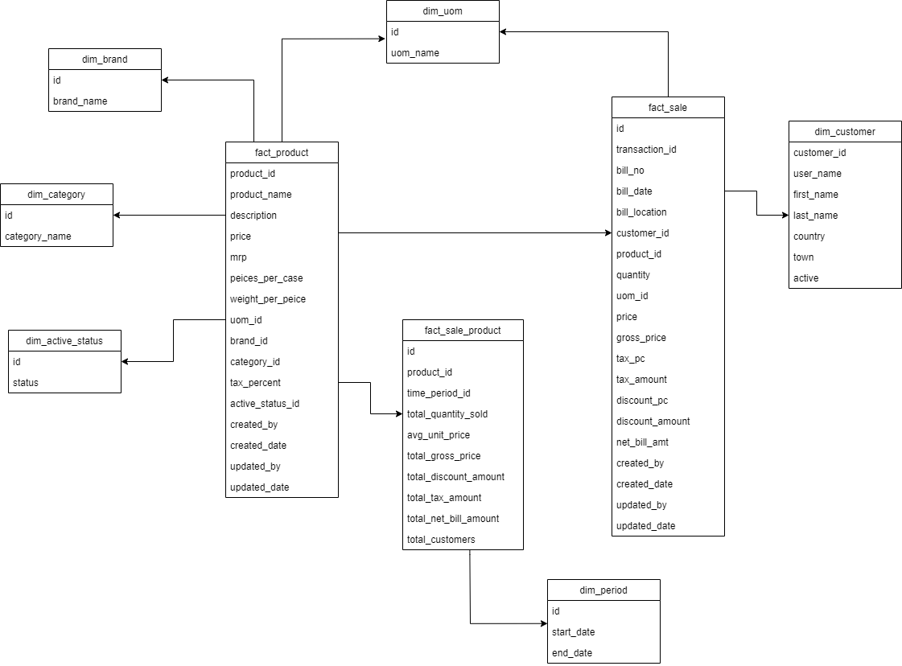

# Requirements Gathering and Modeling for eCommerce
The following is the requirements gathering, conceptual model and physical model of the data warehouse to analyze the sales.

## Requirements Identification
The following requirements were identified:
- To find out the trends among the customers
- To analyze their sales to invest more on products that are selling fast 
- To invest more on high profit products
- To analyze the sales and remove products that are not selling so good

## Potential area of analysis
- sales
- products
- product brands
- customer

## Conceptual Data Modeling

To model the data in a data warehouse, we identify the dimensions table and facts table. We then build a conceptual model using different design schemas. All the steps of conceptual data modeling of the data warehouse are briefly explained hereafter.

#### 1. Identifying Dimensions Table
The following are the dimension tables identified for the data warehouse to analyze the sales:
```dim_uom``` - Dimension table containing different units of measures
```dim_brand``` - Dimension table containing brand information of products
```dim_category``` - Dimension table containing category of products
```dim_customer``` - Dimension table consisting information of customers
```dim_active_status``` - Dimension table containing the active status of products
```dim_period``` - Dimension table having two dates for analysis of sales

#### 2. Identifying Facts Table
Similarly after identifying the dimension tables, we now identify the fact tables to create the data warehouse and carry out the analysis. The fact tables identified are:
```fact_sale``` - Consists all the records of sales of products 
```fact_sale_product``` - Used for the summerization of sale of any specific product in a certain time frame of dim_period
```fact_product``` - Used as the description of products 

#### 3. Identifying the attributes of facts and dimension tables
This step occurs in the logical design modeling phase. But it can be done in conceptual modeling as well. Here, we identify all tha attributes of the entities pre-sepcified (in number 1 and 2 above).

The attributes of the fact and dimension tables can be identified as:

| Table Name | Attributes | 
| :---: | :---: | 
| ```dim_uom``` | id, uom_name | 
| ```dim_brand``` | id, brand_name | 
| ```dim_category``` | id, category_name | 
| ```dim_active_status``` | id, status | 
| ```dim_period``` | id, start_date, end_date | 
| ```fact_product``` | product_id, product_name, description, price, mrp, peices_per_case, weight_per_case, uom_id, brand_id, category_id, tax_percent, active_status_id, created_by, created_date, updated_by, updated_date | 
|```fact_sale_product```|id, product_id, time_period_id, total_quantity_sold, unit_price, total_gross_price, total_tax_price|
|```fact_sale```|id, transaction_id, bill_no, bill_date, bill_location, customer_id, product_id, quantity, uom_id, price, gross_price, tax_pc, tax_amount, discount_pc, discount_amount, net_bill_amt, created_by, created_date, updated_by, updated_date|

#### 4. ER Diagram
After we identify the tables abd their attributes, we now create an ER diagram for the data warehouse. Since, we have multiple facts table, our ER diagram would be of Fact Constellation Schema design which incorporated multiple facts table.

The proposed ER Diagram of the data warehouse would be:



## Physical Modeling

After conceptual modeling of the system, we now build the physical modeling (or implementation) of the data warehouse. Physical Modeling is done using the postgresql database. All the DDL queries of the physical model of the data warehouse are listed below:

